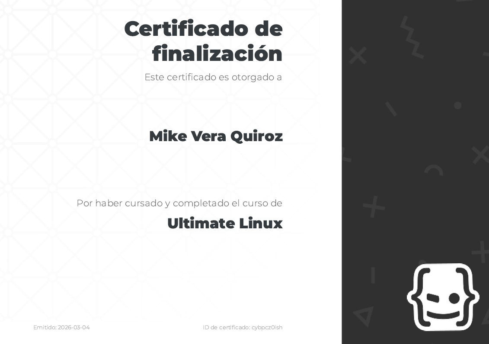

## Linux Course with Nicolas Schurmann

```bash
# Academy
$ https://academia.holamundo.io/courses/ultimate-linux
```

```bash
# My Certificate
$ https://academia.holamundo.io/certificates/cybpcz0ish
```
[](https://academia.holamundo.io/certificates/cybpcz0ish)
